<!-- ===================================================== -->
<!-- HERO -->
<!-- ===================================================== -->

<h1 align="center">

&nbsp;Welcome to My GitHub Profile&nbsp; 👋
</h1>

<table align="center">
<tr>
<td width="560" align="center" valign="top">

<h1 align="center">( •̀ᴗ•́ ) ̑̑</h1>

 

</td>
<td width="260" align="center" valign="middle">
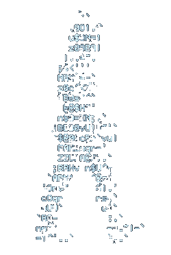
</td>
</tr>
</table>

<b><i>❝ Always léarning — Never a finished story! ❞</i></b>

 

<!-- ===================================================== -->
<!-- WHAT I WORK WITH -->
<!-- ===================================================== -->

<h2 align="center">&gt;&gt;&gt; What I Work With &lt;&lt;&lt;</h2>

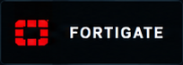
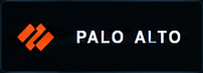
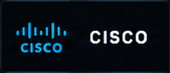
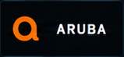
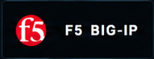
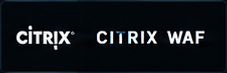
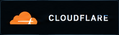
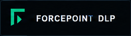
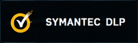
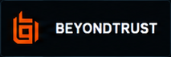
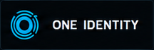
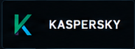
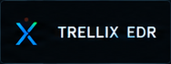
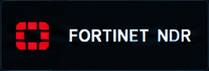
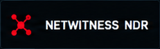
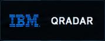
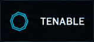
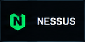
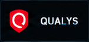

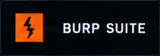
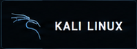
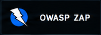
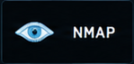
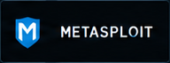
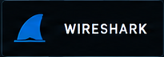
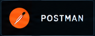

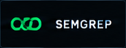
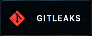
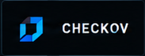
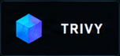
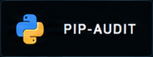
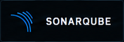
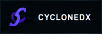

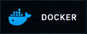
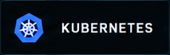
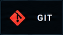
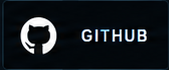
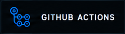
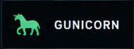

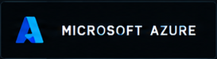
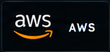
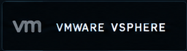
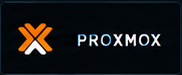
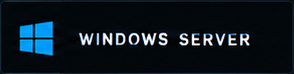
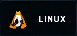
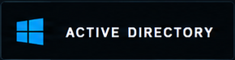
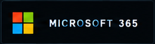

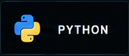
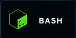

<!-- ===================================================== -->
<!-- CERTIFICATIONS & FOCUSED TRAINING -->
<!-- ===================================================== -->

<h1 align="center">>>> Certifications <<< </h1>

 

<table align="center">
<tr>
<th>📄 Title</th>
<th>🏛️ Provider</th>
<th>🗓️ Validity</th>
</tr>
<tr>
<td>CEH v10</td>
<td>EC-Council</td>
<td>✔️ Completed</td>
</tr>
<tr>
<td>CHFI</td>
<td>EC-Council</td>
<td>✔️ Completed</td>
</tr>
<tr>
<td>ECIH v2</td>
<td>EC-Council</td>
<td>✔️ Completed</td>
</tr>
<tr>
<td>Fortinet NSE 1 &amp; NSE 2</td>
<td>Fortinet</td>
<td>✔️ Completed</td>
</tr>
<tr>
<td>Practical API Hacking</td>
<td>TCM Security</td>
<td>✔️ Lifetime</td>
</tr>
<tr>
<td>C# 101 for Hackers</td>
<td>TCM Security</td>
<td>✔️ Lifetime</td>
</tr>
<tr>
<td>Implementing DevSecOps with Docker &amp; Kubernetes</td>
<td>BPB Publications</td>
<td>✔️ Lifetime</td>
</tr>
<tr>
<td>CISM</td>
<td>ISACA</td>
<td>⏳ Ongoing</td>
</tr>
<tr>
<td>CISSP</td>
<td>ISC2</td>
<td>⏳ Ongoing</td>
</tr>
<tr>
<td>OSCP</td>
<td>OffSec</td>
<td>⏳ Ongoing</td>
</tr>
<tr>
<td>ISO/IEC 27001 Lead Implementer</td>
<td>PECB</td>
<td>⏳ Ongoing</td>
</tr>
</table>

 

<!-- ===================================================== -->
<!-- LET'S CONNECT -->
<!-- ===================================================== -->

<h1 align="center"> >>> Let's Connect <<< </h1>

<b>Open to Security Engineering • Cloud Security • AppSec • DevSecOps opportunities</b>

Interested in collaborating, discussing security, or building something interesting? Let's connect.

 

&nbsp;

&nbsp;

 

──────────── ◈ ────────────

 

<i>❝ The only truly secure system is one that is powered off, 
cast in a block of concrete, and sealed in a lead-lined room. ❞</i>
  
— Gene Spafford

 

<b><i>...I still try though. 👨‍💻</i></b>

 

<code>amr@cyber:~$ ./connect.sh █</code>

 

Thanks for stopping by.

